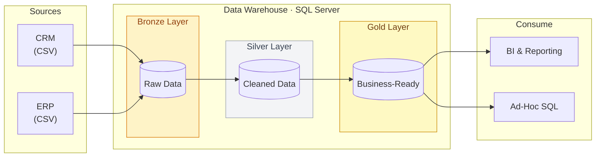

# SQL Data Warehouse Project
A modern Data Warehouse using SQL Server, including ETL processes, data modeling and analytics.

This project demonstrates a comprehensive data warehousing and analytics solution, from building a data warehouse to generating actionable insights. 
Designed as a portfolio project, it highlights industry best practices in data engineering and analytics.

# Datawarehouse - Medallion Architecture

A data warehouse project built on **SQL Server** using the **medallion architecture** (Bronze → Silver → Gold) to transform raw source data into business-ready analytics for Nedbank.

## Architecture Overview



## Layer Details

**Bronze Layer**: Stores raw data as-is from the source systems. Data is ingested from CSV Files into SQL Server Database.
**Silver Layer**: This includes data cleansing, standardization, and normalization processes to prepare data for analysis.
**Gold Layer**: This houses business-ready data modeled into a star schema required for reporting and analytics.

### Sources
| Property | Value |
|----------|-------|
| Systems | CRM, ERP |
| Object Type | CSV Files |
| Interface | Files in Folders |

### Bronze Layer — Raw Ingestion
| Property | Value |
|----------|-------|
| Object Type | Tables |
| Load Method | Batch Processing · Full Load · Truncate & Insert |
| Transformations | None (as-is) |
| Data Model | None (as-is) |

### Silver Layer — Cleansed & Standardized
| Property | Value |
|----------|-------|
| Object Type | Tables |
| Load Method | Batch Processing · Full Load · Truncate & Insert |
| Transformations | Data Cleansing · Standardization · Normalization · Derived Columns · Enrichment |
| Data Model | None (as-is) |

### Gold Layer — Business-Ready
| Property | Value |
|----------|-------|
| Object Type | Views |
| Load Method | No Load (virtual) |
| Transformations | Data Integrations · Aggregations · Business Logics |
| Data Model | Star Schema · Flat Table · Aggregated Table |

### Consumers
| Consumer | Description |
|----------|-------------|
| BI & Reporting | Dashboards and scheduled reports |
| Ad-Hoc SQL Queries | Analyst-driven exploration |

## Tech Stack

- **Database**: SQL Server
- **ETL Pattern**: Batch Processing (Full Load, Truncate & Insert)
- **Modeling**: Star Schema, Flat Tables, Aggregated Tables
- **Consumers**: BI Tools, Ad-Hoc SQL

## Project Structure

```
├── bronze/          # Raw ingestion scripts
├── silver/          # Cleansing & standardization
├── gold/            # Business logic views
├── docs/            # Architecture diagrams
│   ├── architecture.svg
│   └── architecture.mermaid
└── README.md
```
